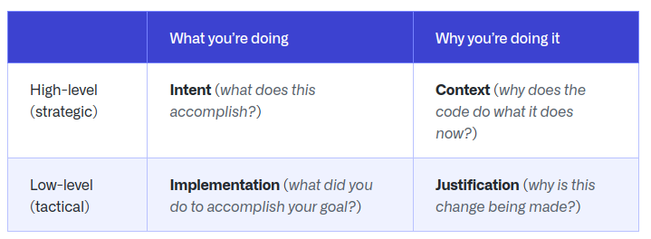
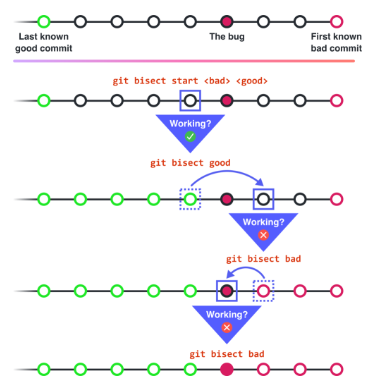

# Write better commits, build better projects

url: <https://github.blog/2022-06-30-write-better-commits-build-better-projects> \
tags: git best practices, commit messages, git branches, collaboration

- high quality commits increase maintainability of a project
- commit = snapshot of your entire repository, based around logical units of change
- commits should tell a story
- commit history is the best tool to understand code first hand

Writing better commits

- one high level concept per branch, don't mix multiple refactorings into one
- treat commits as building blocks, e.g. bugfix, refactor, style, feature, ...
- outline your narrative and reorganize commits to tell a coherent story
- can use git interactive rebase for that

Resize and stabilize commits

- don't present too much or not enough information at once
- commits with incomplete features fail to build, that's very bad
- bugfixes in massive commits require a lot of untangling
- make each commit **small** and **atomic**
  - one commit does one thing / minimal scope
  - one commit is a stable, independent unit of change
  - repo should build and pass tests on each commit

Explain the context - commit message

- describe what you are doing and why you are doing it
- instead of long code comments, use commit messages for piecewise clarification

- organize as follows:
  1. Intent (title)
  2. Context
  3. Justification
  4. Implementation

Harness the benefits

- easy code review, commit-by-commit possible
- easily find bugs with git bisect

