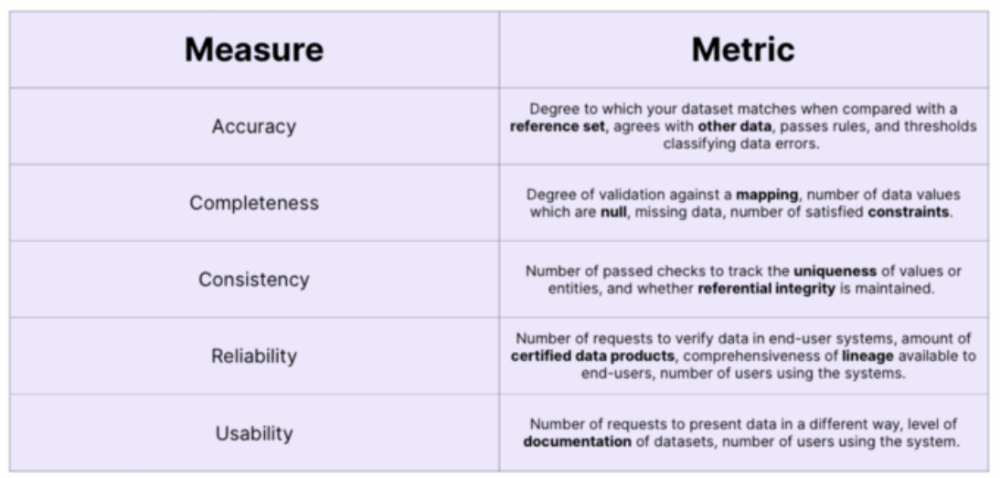
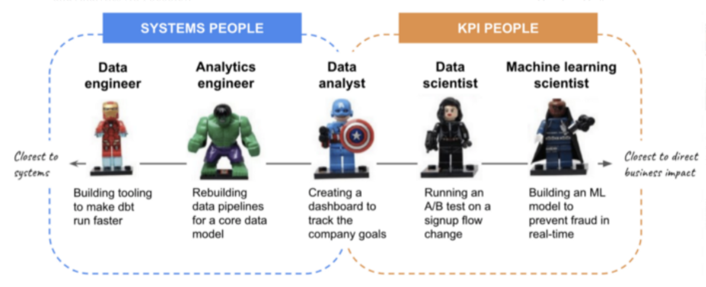

# How to Measure the ROI of Your Data Team?

url: <https://towardsdatascience.com/how-to-measure-the-roi-of-your-data-team-9c60a939f247> \
tags: metric, kpi, data funnel, etl

Why?

- show business impact
- invest in team and tooling

Challenges:

- no established best practices, metrics, kpi
- data teams support other teams/projects
- indirect impact

Measure ROI of two key stages:

1) Clean data

    - measures from Metaplane
    - accuracy: whether data describes reality
    - completeness: how complete does it describe reality
    - consistency: data in itself consistent
    - reliability: is data regarded as true by the user?
    - usability: data accessible and understandable?

2) Operationalisation

    - ability to roll out data into self-service for other teams
    - metric: number of problems you solve for other teams, e.g. number of reductions of requests

Different roles in the data team:

Metrics:

- systems people: data quality,  data uptime, infrastructure cost saving
- analytics/kpi people: turnaround time question-answer
