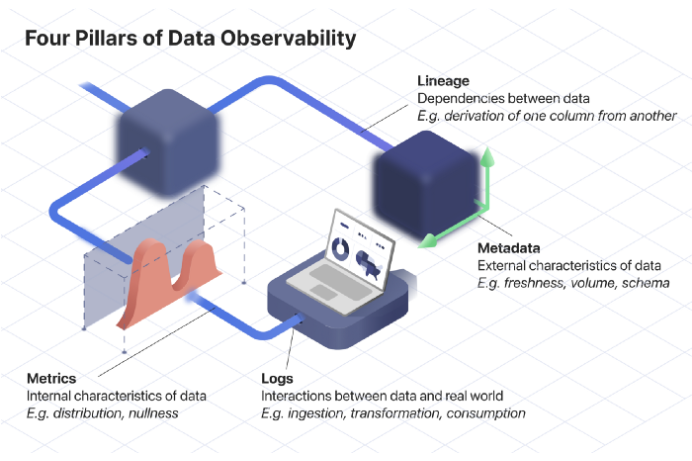

# The Origins, Purpose and Practice of Data Observability

url: <https://towardsdatascience.com/the-origins-purpose-and-practice-of-data-observability-baa12db46755> \
tags: data observability, surface area of data, pillars of data observability

Definitions:

- data observability: degree of visibility we have into our data systems
- observability: instead of observing every piece of information being processed, restrict observation to a few key outputs
- data quality monitoring: alerts s to problems, think smoke test
- data observability monitoring: understand why problem occurred, think root cause analysis

Purpose:

- understand the state of data systems
- increase awareness and trust in that system
- zettabytes of data are useless if it can't be trusted
- use cases: incident management, root-cause analysis, usage analytics

Pillars of observability / core components:

- metrics: internal characteristic of data, think distributions
- metadata: external characteristics of data, think timestamps etc.
- lineage: dependency relationships between pieces of data, e.g. column-level lineage between db column and dashboard
- logs: interactions between data and real world, e.g. number of times a dashboard has been viewed

Five consistent goals / practical implications:

- saving engineering time
- reduce lapses in data quality: cost of poor data quality
- increase leverage of the data team: automate some chores
- expanding data awareness: optimize your teams own workflows
- preserving trust
