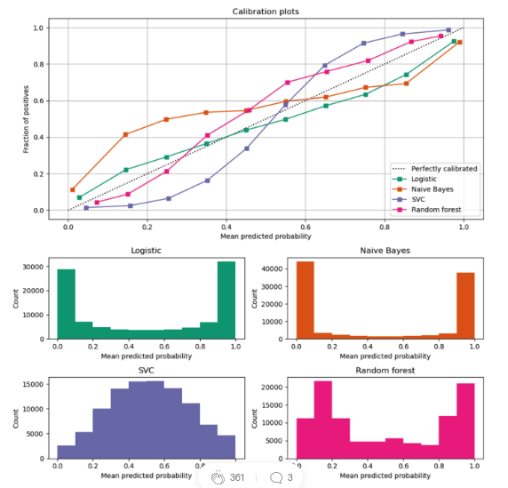

# Estimating the performance of an ml model in the absence of ground truth

url: <https://towardsdatascience.com/estimating-the-performance-of-an-ml-model-in-the-absence-of-ground-truth-cc87dbf6e57> \
tags: model evaluation, missing labels, missing ground truth, few shot learning, real time model evaluation, NannyML

Model monitoring best practices:

- monitor a model in production
- pay special attention to silent failures: model deteriorates over time without obvious reason

Reasons models silently fail:

- data drift = change in distribution of model inputs over time
  - detect univariate data drift with statistical tests, e.g. Kolmogorov-Smirnov test (assumes feature independence)
- concept drift = change in mapping between model input and target variable, i.e. decision boundary changes
  - detect correlation between inputs and labels in training and production
- combination of the above

Predicting performance of model without ground truth:

- scenarios
  1. near real-time ground truth, e.g. online advertising
  2. delayed ground truth, e.g. loan default, customer churn
  3. no ground truth, e.g. know your customer process
- aside: model prediction outputs are rarely well-calibrated to be used as probability estimates
  - use calibration curves and reliability diagrams to verify the calibration

- use confidence based performance estimation (CBPE) for example already implemented by NannyML
  - leverages prediction confidence and expected error rates
  - assumes well-calibrated probabilities (provided by NannyML), no concept drift
  - ground truth is replaced by prediction confidence
