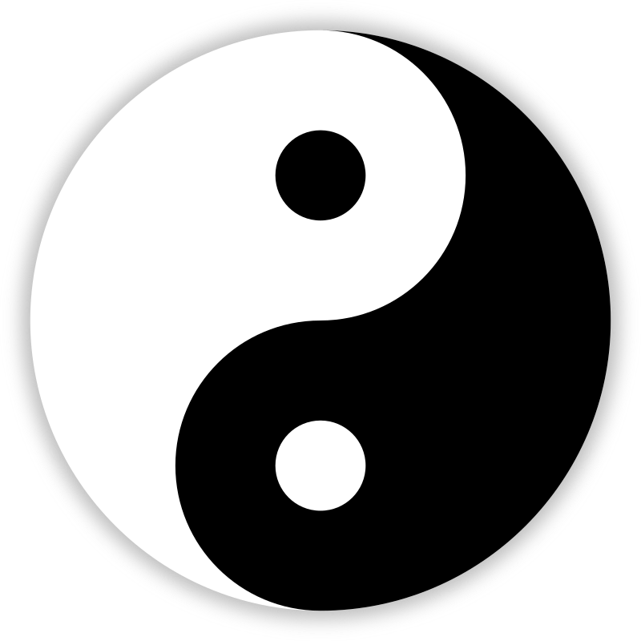

# Yinsights

A journey into the Philosophy & Practice of Yin Yoga by Bernie Clark

- [Yinsights](#yinsights)
  - [Introducing Yinsights](#introducing-yinsights)
  - [Chapter 1: What is Yin Yoga?](#chapter-1-what-is-yin-yoga)
    - [How does it work?](#how-does-it-work)
    - [Yin and Yang](#yin-and-yang)
    - [Yin tissues and yang tissues](#yin-tissues-and-yang-tissues)
    - [The theory of exercise](#the-theory-of-exercise)
  - [Chapter 2: The History of Yin Yoga](#chapter-2-the-history-of-yin-yoga)
    - [Origins](#origins)

## Introducing Yinsights

metaphor yang mountain and yin river: two complementary styles of practicing yoga and meditation

## Chapter 1: What is Yin Yoga?

- yin yoga is for the joints not the muscles
- yang yoga is a more acvtive style focussing on muscles and strength

### How does it work?

- targets are connective tissues: ligaments, bones, joints
- targets hips, pelvis, lower spine

### Yin and Yang

Philosophy:

- patterns of life are formed by contrast
- harmony and health are created when contrasting aspects are in balance
- the middle point "Dao" is the tranquility found in the center of all events
- when we leave the center we take on aspects of yin and yang
- yin and yang are not opposites but complementary
- existence is never static, so yin and yang are always in flux
- yin in chinese = shady side of a hill or stream

Yin: dark, cold, passive, inside, solid, slow, right, dim, downward, substance, water, matter, mysterious, female, moon, night, earth, even, dragon

Yang: light, hot, active, outside, hollow, rapid, left, bright, upward, function, fire, energy, obvious, male, sun, day, heaven, odd, tiger

1. Yin Contains Yang:

- white dot within paisley swirl
- yin contains yang, and also yin is always found within yang
- in yoga practice, even in yang style asanas we carefully watch our breath which is a yin aspect

2. Yin Becomes Yang:

- yin becomes yang, and yang transforms into yin
- transformation can be slow or rapid
- e.g. how seasons seamlessly transform into each other, e wake up in the morning, work long weeks for a long time (yang), suddenly become sick and have to rest (yin)

3. Yin Controls Yang:

- if we become unbalanced for too long, the universe restores balance
- if do do not take care of balancing yin and yang the transition can be quick and devastating

### Yin tissues and yang tissues

- these term are to be understood in relative terms (as always)
- Yang tissues: muscles (elastic, hot), blood, skin
- Yin tissues: ligaments (cool), bones (plastic), joints
- but not absolute: muscles are yin in terms of water content, and ligaments would be yang in terms of water content

- Yang styles of yoga:
  - stress the fiber of the muscles, this is not appropriate for ligaments and joints
  - designed not to stress the joints
  - align body before assanas
- Yin styles of yoga:
  - apply gentler pressure to the plastic tissues for a longer period of time
  - create space and strength in the joints

### The theory of exercise

- always: must stress the tissue first (yang), then allow it to rest and recover (yin)
- **do not apply yang exercise techniques to yin tissues**

## Chapter 2: The History of Yin Yoga

- Paul Grilley popularized it (in the West) based on the work of three guides
  - Dr. Garry Parker (taught him anatomy)
  - Paulie Zink (taught him daoist yoga)
  - Dr. Hiroshi Motoyama (reminded him of yogas greater purpose)

### Origins

- many documents written thousands of years ago
  - Hatha Yoga Pradipika
  - Gheranda Samhita
  - Yoga Sutra
  - Indian Vedas
- none of them were meant to be read alone
  - require guidance from a guru
  - books were used like notes
  - most knowledge was deliberately kept hidden
- purpose of the yoga practice was to prepare the student for meditation
  - yoga means discipline
  - when still and undistracted by bodily sensations, meditation can arise
  - in meditative state realization and liberation can arise
- hatha yoga
  - build strong, healthy body, that allows yogi to meditate for many hours
  - describes only 16 asanas
  - lotus pose (padmasana) is recommended for pranayama breathing
- by the time of the british raj asanas were blended with gymnastics, wrestling and other yang like exercises
  - yoga practice moved away from seated yin-like poses
  - focusing more on strength
  