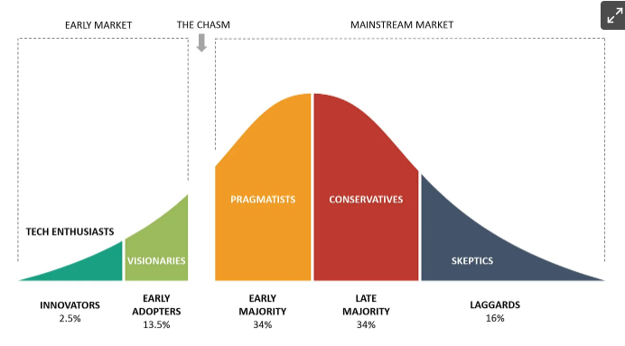
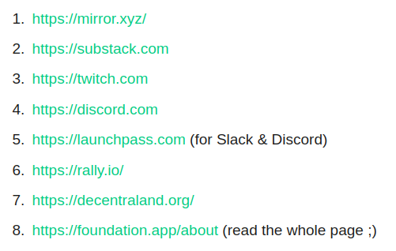

# The rate of return is always smallest when you follow the crowd

url: <https://www.wearepermissionless.xyz/p/the-rate-of-return-is-always-smallest> \
tags: self improvement, soft skills, life skills, financial independence

- people that were much earlier to the party have moved on when things become popular:
  - visionaries have already mined the opportunities and positioned themselves for substantial returns
  - the early adopters are seeking out new areas of growth

- relevant examples: instagram, youtube, wellness, health, lifestyle
- when the news is quiet the hype is non-existent and the market is bearish - that is when all the money is made

1. Simplify: are you swimming upstream or downstream?
    - are you fighting resistance or going with the flow?
    - fighting for followers in a saturated market = resistance
    - early adopter innovating = going with the flow
2. Multiply: find a few multidisciplinary thinkers you can learn from, learn about:
    - nutrition. mindset and mental health
    - holistic and alternative medicine
    - individualism, critical thinking and strategy
    - investing, budgeting and taxation
    - building and managing wealth
    - spirituality and meditation
    - energy and time management
    - self-love, honesty, respect and communication
    - emerging markets and technology
3. Diversify: monetize your future
    - build in a way that allows your work to be invested in over the long run
    - build recurrent income streams
    - internet democratizes, decentralizes and helps capture value

